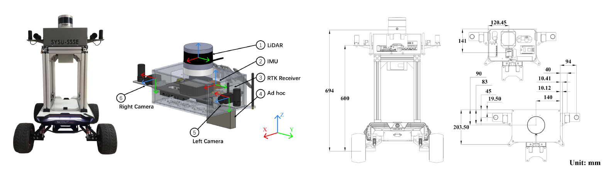
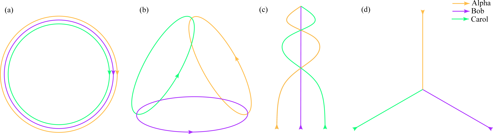
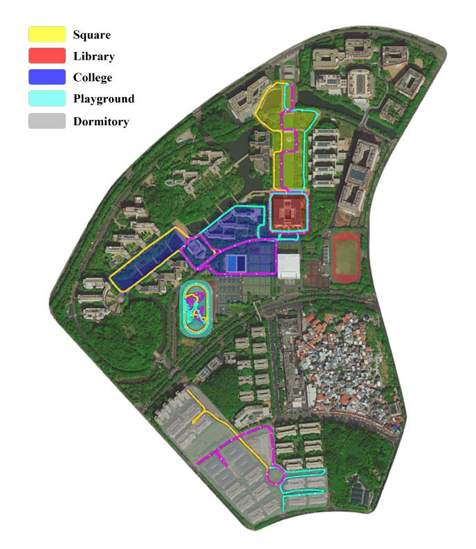
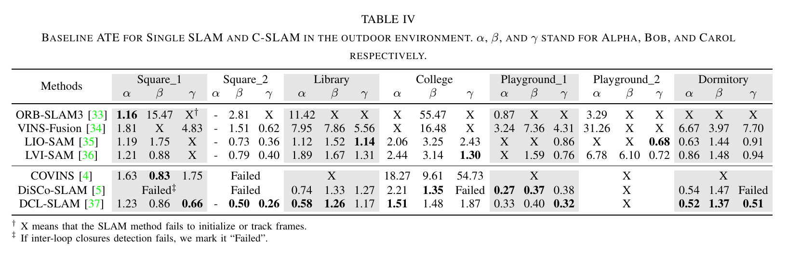

# S3E: A Large-scale Multimodal Dataset for Collaborative SLAM

**Authors:** Dapeng Feng, Yuhua Qi*, Shipeng Zhong, Zhiqiang Chen, Yudu Jiao, Qiming Chen, Tao Jiang, Hongbo Chen

<!-- https://user-images.githubusercontent.com/18318646/197709283-a794c23d-3f43-4388-9ce0-ea09e0f10324.mp4 -->

<!-- https://user-images.githubusercontent.com/18318646/197722969-0aaf8670-0783-48bb-a05d-d9056aae626c.mp4 -->

<!-- https://user-images.githubusercontent.com/18318646/197725374-16536150-32bd-4d1b-bd64-4e104b581f65.mp4 -->

<!-- The HD video is available on [Bilibili](https://www.bilibili.com/video/BV1Ze41137kx/?vd_source=78d041dc03a4aac231b5cac62feffc70). -->

## **<font color='red'>Update ! </font>**
### 2024/04/02 We are currently in the process of integrating UWB data into S3E, and anticipate the release of the new dataset in the near future.
### 2023/05/26 [BaiduYun](https://pan.baidu.com/s/18zzxXACyd3W3OkbSg2vLrA?pwd=ivnm) is available.
### 2022/11/08 ~~The data download [link](https://download.amovlab.com/s3e/) is available.~~

<!-- ## Abstract:

With the advanced request to employ a team of robots to perform a task collaboratively, the research community has become increasingly interested in collaborative simultaneous localization and mapping. Unfortunately, existing datasets are limited in the scale and variation of the collaborative trajectories they capture, even though generalization between inter-trajectories among different agents is crucial to the overall viability of collaborative tasks. To help align the research community's contributions with real-world multiagent ordinated SLAM problems, we introduce S3E, a novel large-scale multimodal dataset captured by a fleet of unmanned ground vehicles along four designed collaborative trajectory paradigms. S3E consists of 7 outdoor and 5 indoor scenes that each exceed 200 seconds, consisting of well synchronized and calibrated high-quality stereo camera, LiDAR, and high-frequency IMU data. Crucially, our effort exceeds previous attempts regarding dataset size, scene variability, and complexity. It has 4x as much average recording time as the pioneering EuRoC dataset. We also provide careful dataset analysis as well as baselines for collaborative SLAM and single counterparts.

## Main Conbributions:

- We collected large-scale C-SLAM datasets with three ground robots. We mounted a top 16-beam 3D laser scanner on each robot, two high-resolution color cameras, a 9-axis IMU, and a dual-antenna RTK receiver.
- We recorded the long-term sequences based on the four well-designed trajectory categories, including different intra/inter-robot loop closures situations. To our knowledge, it is the first C-SLAM dataset for LiDAR, visual, and inertial data in various indoor and outdoor environments.
- We evaluated state-of-the-art C-SLAM and its single counterparts using different sensor recordings and proposed a comprehensive benchmark to analyze the characteristics of different methods. -->

## Sensors

<p align="center">  </p>

## Data format

<div align="center">

| Topic                           | Type                             |
| --------------------------------| -------------------------------- |
| /xxx/left_camera/compressed     | sensor_msgs/CompressedImage      |
| /xxx/right_camera/compressed    | sensor_msgs/CompressedImage      |
| /xxx/velodyne_points            | sensor_msgs/PointCloud2          |
| /xxx/imu/data                   | sensor_msgs/Imu                  |
| /xxx/nlink_linktrack_nodeframe2 | std_msgs/FLoat64MultiArray (UWB) |

</div>

We store the data captured by sensors in rosbag format. All the topics are listed in the above table. Note that xxx stands for the code of different robots, e.g., Alpha, Bob, Carol. And we provide the ground-truth as text files in UTM coordinates.

<!-- ## Sequence

<p align="center">  </p>

We design four kinds of trajectory following different intra/inter-robot loop closures ethics.

1. The agents run in the same ring. 

2. The agents run in different rings with the interactions pairwisely. 

3. The agents run forward in the different curves with the interactions in the same scenes. 

4. The agents start from different sites and only meet in the same place in the end.

<p align="center">  </p>

<div align="center">

| Name              | Env.    | Time[s] | Size[GB] | Features              |
| ----------------- |:------- | ------- | -------- | --------------------- |
| Square_1          | Outdoor | 460     | 17.8     | Staight line          |
| Square_2          | Outdoor | 255     | 9.4      | Staight line          |
| Library           | Outdoor | 454     | 16.3     | Circle                |
| College           | Outdoor | 878     | 29.4     | Circle, Long-term     |
| Playground_1      | Outdoor | 298     | 8.7      | Circle                |
| Playground_2      | Outdoor | 222     | 6.3      | Random walk           |
| Dormitory         | Outdoor | 671     | 23.5     | Few overlap           |
| Teaching_Building | Indoor  | 798     | 27.3     | Indoor/Outdoor toggle |
| Laboratory_1      | Indoor  | 292     | 9.6      | Room                  |
| Laboratory_2      | Indoor  | 391     | 12.7     | Room                  |
| Laboratory_3      | Indoor  | 410     | 13.3     | Room                  |
| Laboratory_4      | Indoor  | 380     | 12.7     | Room                  |

</div> -->

## Calibration

We provide the well calibration between the left camera and other sensors in the yaml file ([Alpha](configs/alpha.yaml), [Bob](configs/bob.yaml), [Carol](configs/carol.yaml)).

<!-- ## Ground Truth

The high buildings and trees in our outdoor experiment will **disturb** the RTK device. Hence, we only provide the ground truth when the RTK device fixes the solution. And we only provide the start/end points generated by the RTK device or Motion Capture system in the indoor case. -->

## Baselines



## License

This work is under the **Apache 2.0** license.

## Citation

```latex
@misc{https://doi.org/10.48550/arxiv.2210.13723,
  doi = {10.48550/ARXIV.2210.13723},
  url = {https://arxiv.org/abs/2210.13723},
  author = {Feng, Dapeng and Qi, Yuhua and Zhong, Shipeng and Chen, Zhiqiang and Jiao, Yudu and Chen, Qiming and Jiang, Tao and Chen, Hongbo},
  keywords = {Robotics (cs.RO), Computer Vision and Pattern Recognition (cs.CV), FOS: Computer and information sciences, FOS: Computer and information sciences},
  title = {S3E: A Large-scale Multimodal Dataset for Collaborative SLAM},
  publisher = {arXiv},
  year = {2022},
  copyright = {arXiv.org perpetual, non-exclusive license}
}
```
